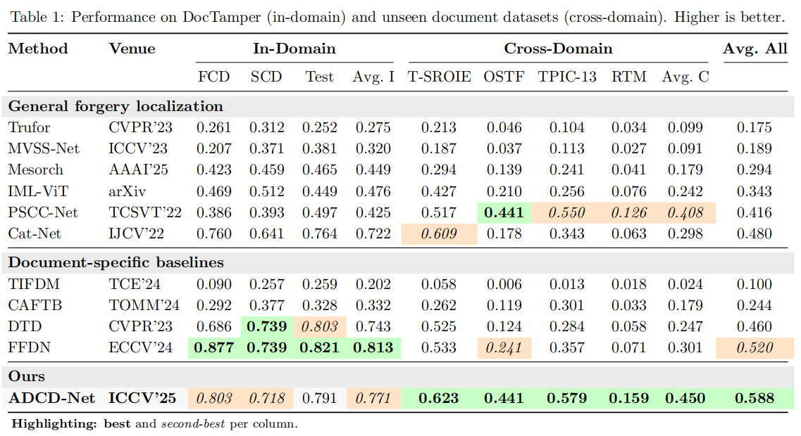

# [ICCV'25] ADCD-Net: Robust Document Image Forgery Localization via Adaptive DCT Feature and Hierarchical Content Disentanglement

[](https://arxiv.org/abs/2507.16397)

## Description

Official code for "ADCD-Net: Robust Document Image Forgery Localization via Adaptive DCT Feature and Hierarchical Content Disentanglement".


## ForensicHub Benchmark (Doc Protocol)



Cross-domain evaluation follows the Doc Protocol. See [ForensicHub](https://github.com/scu-zjz/ForensicHub/issues/26).

## Environment Setup

Dependencies: python 3.10.13, pytorch 2.3.0+cu121, albumentations 2.0.8.

## Data Preparation

### Download DocTamper Data

DocTamper dataset (Training, Testing, FCD, SCD): [DocTamper](https://github.com/qcf-568/DocTamper). `qt_table.pk` and `pks` are in the DocTamper repo.

### Download ADCD-Net Data

OCR masks and checkpoints: [ADCD-Net](https://drive.google.com/file/d/1-5BU3Bavs6SGJpaByua_FhDuUJGoo-iS/view?usp=sharing).

```
ADCDNet.pth # ADCD-Net checkpoint
docres.pkl # DocRes checkpoint
DocTamperOCR/ # OCR mask directory
    ├── TrainingSet # Training set directory
    ├── TestingSet # Testing set directory
    ├── FCD # FCD dataset directory
    └── SCD # SCD dataset directory
```

### Download Doc Protocol Data

4 cross-domain test sets (T-SROIE, OSTF, TPIC-13, RTM):
https://drive.google.com/drive/folders/1xn8mELN8etQwRo_PgS5XV6XTKCZasz_A?usp=drive_link

## Get OCR masks

Use `seg_char.py`. PaddleOCR setup: [PaddleOCR](https://www.paddlepaddle.org.cn/en/install/quick?docurl=/documentation/docs/en/develop/install/pip/linux-pip_en.html).

## Train ADCD-Net

1. Set dataset, OCR mask, and checkpoint paths in `cfg.py`.
2. Run `main.py`.

```python
mode = 'train'
root = 'path/to/root'
docres_ckpt_path = 'path/to/docres.pkl'
```

## Reproduce ForensicHub (Doc Protocol) Results of ADCD-Net

Doc Protocol: train on DocTamper training set, evaluate on seven test sets. DocTamper FCD/SCD/Test set are compressed once using the official DocTamper pickle QFs. Authentic images are skipped.

1. Generate OCR masks for T-SROIE/OSTF/TPIC-13/RTM with `seg_char.py`.
3. Generate path pkl files for T-SROIE/OSTF/TPIC-13/RTM with `build_path_pkl.py`.
4. Update the following in `cfg.py` and run `main.py`.

```python
mode = 'val'
all_ds_name = ['TestingSet', 'FCD', 'SCD', 'T-SROIE_test', 'Tampered-IC13_test', 'RealTextManipulation_test', 'OSTF_test']
pkl_dir = 'path/to/path_pkl'
```

## Citation

If you find our project useful in your research, please cite it in your publications.

```bibtex
@inproceedings{wong2025adcd,
  title={ADCD-Net: Robust Document Image Forgery Localization via Adaptive DCT Feature and Hierarchical Content Disentanglement},
  author={Wong, Kahim and Zhou, Jicheng and Wu, Haiwei and Si, Yain-Whar and Zhou, Jiantao},
  booktitle={Proceedings of the IEEE/CVF international conference on computer vision},
  year={2025}
}
```
